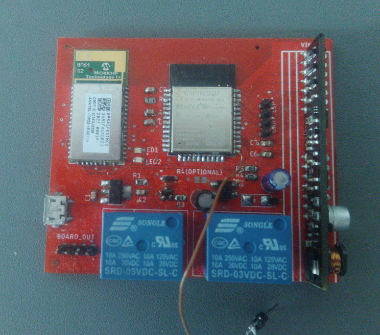
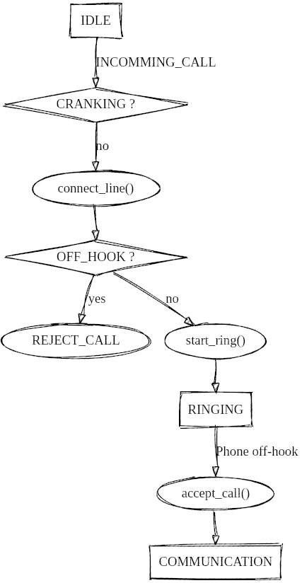

# Marty 1910 bluetooth interface firmware

This repository stores the firmware for getting old marty 1910 phones back to life with a ag1171 and bm64 modules (SLIC and Bluetooth modules).

- Vidéo :   
[](https://www.youtube.com/watch?v=Hyl_VwFzOQQ)
- Hackaday.io : [Marty 1910 adapter](https://hackaday.io/project/181056-marty-1910-magneto-phone-bluetooth-adapter)




## Contents
<!-- vim-markdown-toc GitLab -->

* [requirements](#requirements)
* [Configuring the BM64 module](#configuring-the-bm64-module)
* [directory structure](#directory-structure)
* [Firmware description](#firmware-description)

<!-- vim-markdown-toc -->

## requirements
- esp-idf : https://docs.espressif.com/projects/esp-idf/en/latest/esp32/get-started/index.html#installation-step-by-step
- ftdi (for flashing and install)

## Configuring the BM64 module
The BM64 modules requires configuration prior to using it. The configuration process is detailed here : https://github.com/danjulio/blue_pot#bm64-configuration, and this project works with the exact same BM64 configuration as the Blue POT project.

## directory structure
```bash
tree main
main
├── ag1171_driver.c // SLIC driver, including RING signal generation & hangup detection
├── ag1171_driver.h
├── bm64_driver.c // BM64 driver : incomming call events, place calls, ...
├── bm64_driver.h
├── bm64_strings.h
├── CMakeLists.txt
├── component.mk
├── firmware_main.c // main logic
├── line.c  // cranking detection and line relay driving
└── line.h
```

```bash
tree hardware
hardware
├── bluetooth.brd # PCB design
├── bluetooth.csv # list of components
└── bluetooth.sch # schematic
```

## Firmware description



